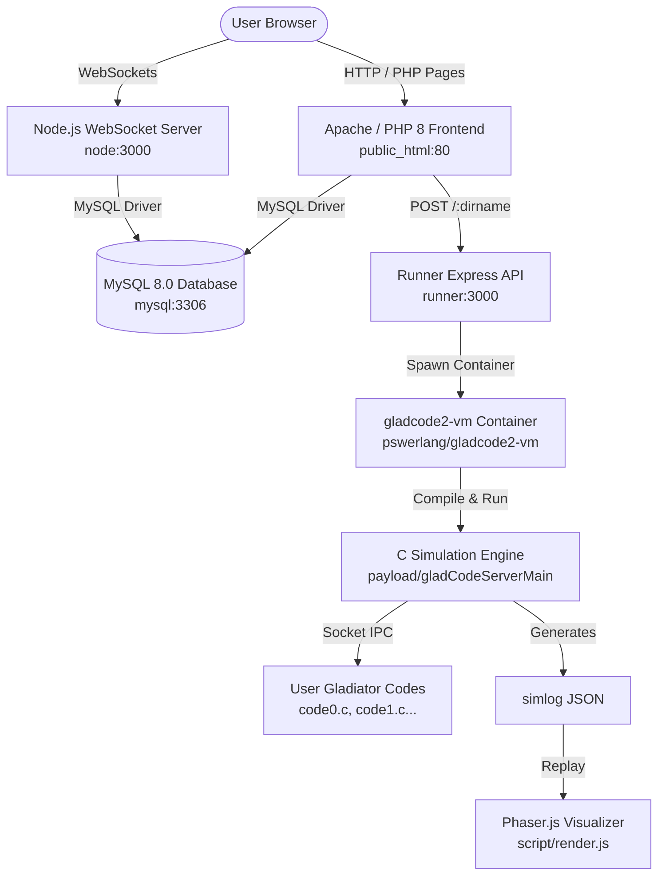

# gladCode 2

gladCode is a web-based programming game and arena where players code AI gladiators in C or Python to battle autonomously. The platform features real-time visualization with Phaser.js, visual block-based programming (Blockly), raw C/Python editing (ACE Editor), tournament systems, and live WebSocket notifications.

---

## 📐 Architecture Overview

gladCode 2 runs as a microservices architecture managed via **Docker Compose**:



---

## 🛠️ Microservices Breakdown

| Service | Location | Tech Stack | Role & Responsibilities |
| :--- | :--- | :--- | :--- |
| **Apache / PHP Frontend** | `public_html/` | PHP 8, Apache, jQuery, Phaser.js | Web UI, user auth, gladiator management, tournament routing, simulation invocation |
| **Runner Service** | `runner/` | Node.js (ESM), Express, Docker CLI | Docker-in-Docker executor. Receives battle requests, runs containerized simulations |
| **WebSocket Server** | `node/` | Node.js, Express, Socket.IO | Real-time chat, live notification delivery, tournament updates |
| **Simulation Engine** | `payload/` | C (GCC, pthreads, Sockets) | Multi-threaded arena server executing turn-by-turn combat between gladiator scripts |
| **Database** | `database-2025.*.sql` | MySQL 8.0 | Stores user accounts, gladiators, tournament schedules, battle logs, and stats |

---

## ⚡ Quick Start & Development Environment

> [!NOTE]
> **No Local Node/Python Requirement**: Node.js and Python are not required on the host machine. All services, scripts, and compilers run inside Docker containers.

### Prerequisites
- [Docker Desktop](https://www.docker.com/) (or Docker Engine + Docker Compose plugin)

### 1. Environment Configuration

Copy environment template files:

```bash
cp .env.example .env
cp public_html/config.json.example public_html/config.json
cp node/config.json.example node/config.json
```

Ensure MySQL credentials in `.env`, `public_html/config.json`, and `node/config.json` match:

```json
{
  "mysql": {
    "host": "mysql",
    "port": "3306",
    "user": "root",
    "password": "root_password",
    "database": "gladcode"
  }
}
```

### 2. Launching Services

Start all containers in detached mode:

```bash
docker compose up -d
```

Service endpoints:
- **Web Frontend**: [http://localhost:80](http://localhost:80)
- **Dev Tools Suite**: [http://localhost:80/dev-tools/](http://localhost:80/dev-tools/)
- **Runner API**: Internal only (`http://runner:3000`)
- **MySQL**: `localhost:3306`

---

## 🗄️ Database Management & Dev Tools

gladCode 2 includes a dev-tools suite in `public_html/dev-tools/`:

### Database Backup & Restore

```bash
cd public_html/dev-tools

# Dump current MySQL database to dump_gladcode.sql
./dump_restore.sh dump

# Restore database from dump_gladcode.sql
./dump_restore.sh restore
```

### Tournament CLI Management

```bash
cd public_html/dev-tools

# List test tournaments
./tournament.sh list

# Reset specific tournament by ID
./tournament.sh reset 12

# List real production tournaments (with pagination)
./tournament.sh list-real 1 10

# Reset real production tournament
./tournament.sh reset-real 45
```

---

## ⚔️ How Gladiator Battles Work

1. **Code Creation**: Users write C or Python gladiator algorithms in `editor.php` using either visual blocks or text editing.
2. **Security Verification**: Before compilation, user code is checked against `public_html/banned_functions.json` to prevent unauthorized memory/game state modification.
3. **Execution Request**: `public_html/back_simulation.php` prepares a temporary run folder under `public_html/runs/{hash}/` with `payload/` files and user scripts (`code0.c`, `code1.c`, etc.), then sends an HTTP POST to `http://runner:3000/{hash}`.
4. **Container Isolation**: Runner spawns `gladcode2-vm` container with restricted CPU (`--cpu-quota=50000`) and a 30-second execution deadline.
5. **Simulation Execution**: `socket_compile.sh` compiles gladiator code, launches `gladCodeServerMain`, and manages socket IPC between gladiators and the C game engine.
6. **Log Replay**: The simulation writes a JSON execution trace (`simlog`). Frontend `script/render.js` parses `simlog` and renders 2D animated combat in Phaser.js.

---

## 📁 Repository Structure

```
gladcode2/
├── .github/                 # GitHub workflows & Copilot instructions
├── Dockerfile-apache        # PHP 8 + Apache + Docker CLI container definition
├── Dockerfile-dind          # Docker-in-Docker container definition for runner
├── compose.yaml             # Docker Compose microservices specification
├── database-2025.*.sql      # Database initialization SQL dumps
├── node/                    # Node.js Socket.IO WebSocket server
├── payload/                 # C battle simulation engine & socket API source
├── public_html/             # Apache web root (PHP backends, JS, CSS, dev-tools)
│   ├── back_simulation.php  # Simulation orchestrator
│   ├── banned_functions.json# Security function filter
│   ├── dev-tools/           # Tournament & DB management CLI/Web suite
│   ├── runs/                # Temporary simulation workspace directory
│   └── script/              # Client-side JS & Phaser.js rendering scripts
└── runner/                  # Express Docker execution service
```

---

## 🛡️ Security & Constraints

- User code runs in unprivileged Docker containers (`gladcode2-vm`).
- CPU execution capped at 50% single core per battle.
- 30-second hard wall-clock timeout enforced by `runner/runner.js`.
- Forbidden functions (`setPosition`, `setHp`, `setAp`, `lvlUp`, etc.) blocked during compilation.
