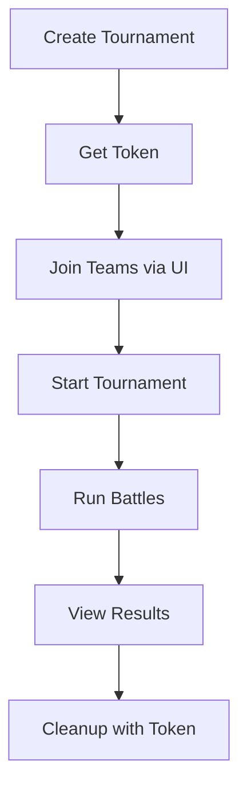

# Tournament Dev Tools - Quick Reference

## 🎯 Most Common Use Cases

### 1. Quick Test Tournament (Web UI - Recommended)
```
http://localhost/dev-tools/index.html
```
- Fill form → Click "Create"
- Note the token
- Test your tournament
- Click "Cleanup" when done

### 2. Quick Test Tournament (CLI)
```bash
./dev-tools/tournament.sh create "My Test" 8
# Returns token: a1b2c3d4e5f6g7h8

# When done:
./dev-tools/tournament.sh cleanup a1b2c3d4e5f6g7h8
```

### 3. Large Tournament Test
```bash
# Create 32-team tournament with 5-min rounds
curl "http://localhost/dev-tools/bootstrap_tournament.php?name=LargeTest&teams=32&maxtime=00:05:00"
```

### 4. See All Test Tournaments
```bash
./dev-tools/tournament.sh list
# Or visit: http://localhost/dev-tools/
```

### 5. Nuclear Option (Delete Everything)
```bash
./dev-tools/tournament.sh cleanup-all
# Requires typing "YES" to confirm
```

## 📋 URL Endpoints

| Endpoint | Purpose | Parameters |
|----------|---------|------------|
| `/dev-tools/index.html` | Web interface | None |
| `/dev-tools/bootstrap_tournament.php` | Create tournament | `?name=X&teams=N&maxtime=HH:MM:SS` |
| `/dev-tools/cleanup_tournament.php` | Delete tournament | `?token=<token>` |
| `/dev-tools/list_tournaments.php` | List all test tournaments | None |
| `/dev-tools/cleanup_all.php` | Delete all | `?confirm=YES_DELETE_ALL` |

## 🔑 Parameter Reference

| Parameter | Default | Min | Max | Format | Example |
|-----------|---------|-----|-----|--------|---------|
| `name` | "Test Tournament {date}" | - | - | String | "Epic Battle 2024" |
| `teams` | 8 | 2 | 50 | Integer | 16 |
| `maxtime` | 00:10:00 | 00:00:01 | - | HH:MM:SS | 00:05:00 |
| `manager` | First user | - | - | Email | user@example.com |

## 🎨 Response Format

All endpoints return JSON:

### Success Response
```json
{
  "status": "SUCCESS",
  "message": "...",
  "data": { ... }
}
```

### Error Response
```json
{
  "status": "ERROR",
  "message": "Error description"
}
```

## 🚨 What Gets Deleted on Cleanup

✅ Tournament entry  
✅ Teams (N teams)  
✅ Gladiator-team associations (N × 3)  
✅ Groups (tournament rounds)  
✅ Group-team entries  
✅ Battle log files  
✅ Cleanup token  

❌ Users (preserved)  
❌ Gladiators (preserved)  
❌ Other tournaments (preserved)  

## 💡 Pro Tips

1. **Always save the cleanup token** - It's shown once during creation
2. **Use the web interface** - It's prettier and more user-friendly
3. **Test with small tournaments first** - 4-8 teams is good for testing
4. **Multiple tournaments OK** - You can have several test tournaments at once
5. **Real gladiators** - The system uses real gladiators from the database
6. **Cleanup before demos** - Remove test data before showing to others

## 🐛 Troubleshooting

| Problem | Solution |
|---------|----------|
| "No users found" | Create at least one user account first |
| "Not enough gladiators" | Reduce team count or create more gladiators |
| "Name already exists" | Use different name or cleanup old tournament |
| "Invalid token" | Check token file in `dev-tools/tokens/` |
| Web UI not loading | Check Apache: `docker compose logs apache` |
| PHP errors | Check error log: `docker compose exec apache cat /var/log/apache2/error.log` |

## 📞 Quick Commands

```bash
# From project root:

# Create via CLI
./dev-tools/tournament.sh create

# Create via curl
curl "localhost/dev-tools/bootstrap_tournament.php?teams=8"

# List all
curl "localhost/dev-tools/list_tournaments.php" | jq

# Cleanup
curl "localhost/dev-tools/cleanup_tournament.php?token=TOKEN"

# Open web interface
./dev-tools/tournament.sh web
```

## 🎓 Typical Workflow



1. Create tournament → Save token
2. Access via gladCode UI
3. Join teams, configure gladiators
4. Start tournament (as manager)
5. Watch battles execute
6. Review results
7. Cleanup using saved token

---

**Remember:** All test tournaments are marked with `[DEV-TEST]` and only those can be cleaned up automatically. This prevents accidental deletion of real tournaments.
